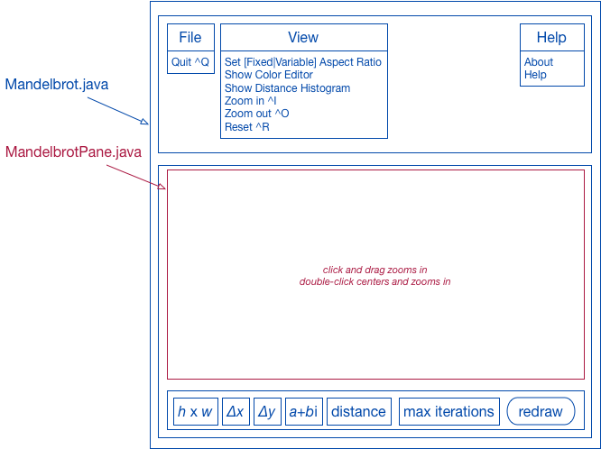

# Mandelbrot viewer

This is intended as a playground for several programming technologies.

Some directions it might take:
- A Java Swing application for viewing the Mandelbrot set;
- A client/server architecture using a web API so that a back-end application can generate views into the Mandelbrot set;
- An Angular 2 web application that uses this API to view the Mandelbrot set;
- A JAX-RS implementation of the API's back end;
- A C++ implementation of the API's back end;
- Variants of the back ends that use extended precision floating point types;
- Performance optimizations;
- Java vs C++ performance comparisons;
- Movie-like animated views into the Mandelbrot set;
- Views into Julia sets.

## The Java Swing application

Design notes:

